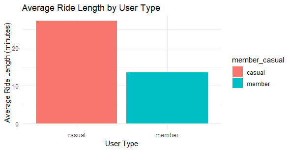
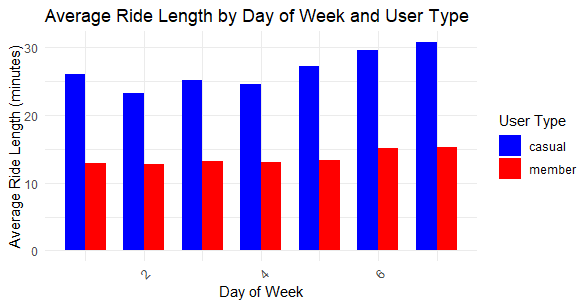
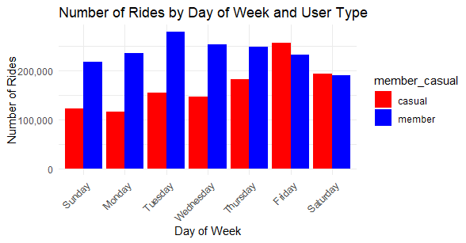

# CYCLISTIC🚲
## What is Cyclistic?
A "fictional" bike-share company that features more than 5,800 bicycles and 600 docking stations. 

It is believed that the company's future success will be achieved by maximizing the number of annual memberships. Therefore, I have to
understand how casual riders and annual members use Cyclistic bikes differently. From these
insights, I will be able to design a new marketing strategy to convert casual riders into annual
members. 


Cyclistic sets itself apart by also offering reclining bikes, hand tricycles, and cargo bikes, making bike-share more inclusive to people with disabilities and riders who can’t use a standard two-wheeled bike. The majority of riders opt for traditional bikes; about 8% of riders use the assistive options. Cyclistic users are more likely to ride for leisure, but about 30% use the bikes to commute to work each day.

## Three questions to solve
- How do annual members and casual riders use Cyclistic bikes differently? 
- Why would casual riders buy Cyclistic annual memberships? 
- How can Cyclistic use digital media to influence casual riders to become members?

## Process
* First, I downloaded the data from the last quarter (June, July, August, and September) in excel and proceeded to bind the four months together to be able to clean and analyze the data together.

  It is important to mention that I decided to work with R studio for completing this project.

```

##DOWNLOAD DATA
august2024_bike <- read.csv('202408-divvy-tripdata.csv')
july2024_bike <- read.csv('202407-divvy-tripdata.csv')
june2024_bike <- read.csv('202406-divvy-tripdata.csv')
may2024_bike <- read.csv('202405-divvy-tripdata.csv')

##DATA CLEANING
#I am binding the datasets because they have the same structure
four_months_data <- bind_rows(august2024_bike, july2024_bike, june2024_bike, may2024_bike)
```

* After this, I continued by cleaning🧹 the duplicates and changing some columns to have them more organized.
```
#removing duplicate rows
four_months_data <- unique(four_months_data)

#separate dates from time
  #Convert columns to POSIXct date-time format if they are not already
four_months_data$started_at <- as.POSIXct(four_months_data$started_at, format = "%Y-%m-%d %H:%M:%OS", tz = "UTC")
four_months_data$ended_at <- as.POSIXct(four_months_data$ended_at, format = "%Y-%m-%d %H:%M:%OS", tz = "UTC")
  #Extract date and time separately
four_months_data$started_date <- format(four_months_data$started_at, "%Y-%m-%d")
four_months_data$started_time <- format(four_months_data$started_at, "%H:%M:%S")
four_months_data$ended_date <- format(four_months_data$ended_at, "%Y-%m-%d")
four_months_data$ended_time <- format(four_months_data$ended_at, "%H:%M:%S")
```

* Calculating the ride lenghts in minutes, and adding the new columns **ride_length** and **day_of_week** 
```
  #calculate ride length in minutes
    #Apply difftime 
four_months_data$ride_length <- sapply(1:nrow(four_months_data), function(i) {
  tryCatch({
    round(difftime(four_months_data$ended_at[i], four_months_data$started_at[i], units = "mins"), 2)
  }, error = function(e) {
    NA  
  })
})


four_months_data$ride_length <- mapply(function(start, end) {
  tryCatch({
    round(difftime(end, start, units = "mins"), 2)
  }, error = function(e) {
    NA  # Return NA for problematic rows
  })
}, four_months_data$started_at, four_months_data$ended_at)

#Add column day of the week
four_months_data$day_of_week <- wday(four_months_data$started_at, label = FALSE, week_start = 1) # 1 = Sunday, 2 = Monday, ...
```

* Creating pivot tables to then plot the results
1. Average ride length for members and casual riders
```
#Calculate the Average Ride Length for Members and Casual Riders
average_ride_length <- four_months_data %>%
  group_by(member_casual) %>%
  summarise(Average_Ride_Length = mean(ride_length, na.rm = TRUE))
```
2. Average ride length by day of the week for each user type
```
average_ride_length_by_day <- four_months_data %>%
  group_by(member_casual, day_of_week) %>%
  summarise(Average_Ride_Length = mean(ride_length, na.rm = TRUE), .groups = 'drop') %>%
  pivot_wider(names_from = day_of_week, values_from = Average_Ride_Length, names_prefix = "Day_")
```
3. Number of Rides for Users by Day of the Week
```
rides_count_by_day <- four_months_data %>%
  group_by(member_casual, day_of_week) %>%
  summarise(Count_of_Rides = n(), .groups = 'drop') %>%
  pivot_wider(names_from = day_of_week, values_from = Count_of_Rides)
```

## Visualization📊

1. Average Ride Length by User Type bar plot



**Observation**: Casual riders have a longer average ride length compared to members.

**Implication**: This suggests that casual riders may be using the service more for leisure or less frequent, but longer trips, possibly on weekends or holidays.

```
ggplot(average_ride_length, aes(x = member_casual, y = Average_Ride_Length, fill = member_casual)) +
  geom_bar(stat = "identity") +
  labs(title = "Average Ride Length by User Type", x = "User Type", y = "Average Ride Length (minutes)") +
  theme_minimal()
```

2. Average Ride Length by Day of the Week for Each User Type



**Observation**: The gap between the ride lengths of members and casuals varies across the week, with casuals generally riding longer, especially on weekends.

**Implication**: Members likely use bikes for regular purposes, showed by the relatively consistent ride lengths across the week. Whereas, casual users' peak on weekends supports the leisure use hypothesis.

```
  #Replacing numerical day of week with actual names for clarity
  day_names <- c("Sun", "Mon", "Tue", "Wed", "Thu", "Fri", "Sat")
  long_data$day_of_week <- factor(day_names[long_data$day_of_week], levels = day_names)
  
  ggplot(long_data, aes(x = day_of_week, y = Average_Ride_Length, fill = member_casual)) +
    geom_bar(stat = "identity", position = position_dodge(), width = 0.7) +
    labs(title = "Average Ride Length by Day of Week and User Type",
         x = "Day of Week",
         y = "Average Ride Length (minutes)",
         fill = "User Type") +
    scale_fill_manual(values = c("blue", "red")) +  # Customize colors if needed
    theme_minimal() +
    theme(axis.text.x = element_text(angle = 45, hjust = 1)) 
```
  
3. Number of Rides by Day of the Week for Each User Type Bar plot



**Observation**: Both members and casual riders show increased ride activities on weekends, with members riding more consistently throughout the week.

**Implication**: The consistent high usage by members throughout the week supports the commuting use, while the peak for casuals during weekends again reveals the recreational use.

```
  ggplot(long_rides_data, aes(x = day_of_week, y = Count_of_Rides, fill = member_casual)) +
    geom_bar(stat = "identity", position = position_dodge()) +
    labs(title = "Number of Rides by Day of Week and User Type", x = "Day of Week", y = "Number of Rides") +
    scale_y_continuous(labels = comma) +  # Use comma to format numbers with commas for thousands
    scale_fill_manual(values = c("casual" = "red", "member" = "blue")) +  # Ensuring color consistency
    theme_minimal() +
    theme(axis.text.x = element_text(angle = 45, hjust = 1))  # Improve x-label readability
```

## Conclusion

**1. How do annual members and casual riders use Cyclistic bikes differently?**

*Data Insight*: From the graphs, members use bikes more consistently throughout the week, which would be for daily routines, while casual riders use peaks on weekends, indicating more of a leisure activity.

*Strategy*: Marketing strategies could emphasize reliability and cost-effectiveness for members, and flexibility and fun for casual riders.


**2. Why would casual riders buy Cyclistic annual memberships?**

*Data Insight*: If casual riders are shown how they might save money or gain additional benefits (like reduced waiting times or access to premium bikes) through membership when they ride frequently on weekends, the value proposition increases.

*Strategy*: Create promotional campaigns that calculate potential savings for casual riders if they switch to annual or weekend memberships, which is their peak usage time.


**3. How can Cyclistic use digital media to influence casual riders to become members?**

*Targeted Advertising*: Use data insights from the usage patterns to craft targeted ads that reach casual riders on digital platforms during times just before typical peak usage (like Friday afternoons before weekends).

*Content Marketing*: Develop content that showcases the benefits of cycling and membership through success stories, user testimonials, and highlighted member-exclusive benefits, distributed via social media, blogs, and online forums where potential users might visit before deciding on their weekend plans.
